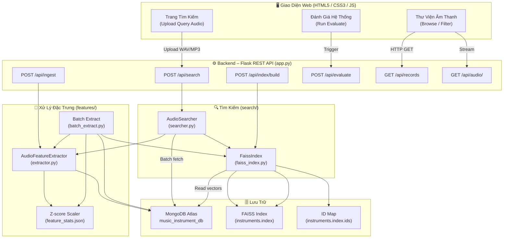
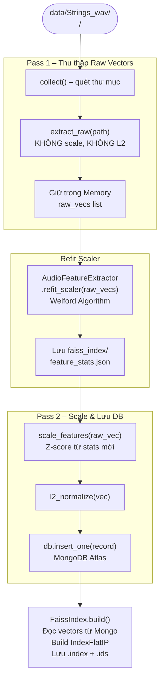

# Sơ Đồ Tổng Quan Hệ Thống
## Hệ Thống Nhận Dạng & Tìm Kiếm Tiếng Nhạc Cụ Bộ Dây

---

## 1. Kiến Trúc Tổng Thể



---

## 2. Luồng Tìm Kiếm (Search Pipeline)

```mermaid
flowchart LR
    A(["🎵 Audio Query\n(.wav / .mp3 / ...)"])
    B["Tiền Xử Lý\nResample → 22 050 Hz\nMono, Trim Silence\nPeak Normalize"]
    C["Trích Xuất Đặc Trưng\n_compute_features()"]
    D["Vector Thô\n100 chiều · float32"]
    E["Z-score Scaling\nfeature_stats.json\nWelford Online Stats"]
    F["L2 Normalize\n‖v‖ = 1"]
    G["FAISS IndexFlatIP\nInner Product Search\n≈ Cosine Similarity"]
    H["Top-K FAISS Hits\n(mongo_id, faiss_index, sim%)"]
    I["MongoDB Batch Fetch\nget_by_faiss_ids()"]
    J(["📋 Kết Quả Top-5\nfilename, instrument,\nsimilarity, note, ..."])

    A --> B --> C --> D --> E --> F --> G --> H --> I --> J
```



---

## 3. Luồng Nạp Dữ Liệu Hàng Loạt (Batch Extract – 2 Pass)



---

## 4. Cấu Trúc Document MongoDB

| Trường | Kiểu | Mô Tả |
|---|---|---|
| `_id` | ObjectId | Khóa chính MongoDB |
| `filename` | String | Tên file (unique index) |
| `file_path` | String | Đường dẫn tuyệt đối trên đĩa |
| `instrument` | String | Tên nhạc cụ (violin, guitar, ...) |
| `instrument_family` | String | `bowed_string` / `plucked_string` |
| `labeled_note` | String | Nốt nhạc parse từ tên file (C#4, ...) |
| `feature_vector` | Array[float] | Vector 100 chiều đã scale + L2 |
| `duration` | Float | Thời lượng (giây) |
| `sample_rate` | Int | Tần số lấy mẫu (Hz) |
| `spectral_centroid` | Float | Tâm phổ trung bình (Hz) |
| `zcr` | Float | Zero Crossing Rate |
| `rms` | Float | Năng lượng RMS |
| `onset_strength` | Float | Cường độ onset trung bình |
| `dominant_f0_hz` | Float | Tần số cơ bản ưu thế (Hz) |
| `dominant_note` | String | Nốt nhạc ước tính (C4, ...) |
| `pitch_range` | String | `low` / `mid` / `high` |
| `faiss_index` | Int | Vị trí trong FAISS index |
| `created_at` | DateTime | Thời điểm tạo (UTC) |

---

## 5. Vector Đặc Trưng 100 Chiều

| Nhóm | Chiều | Phương pháp | Vai Trò |
|---|---|---|---|
| MFCC Mean | 0 – 39 (40d) | `librosa.feature.mfcc`, mean theo time | Hình dạng phổ tổng thể – phân biệt âm sắc nhạc cụ |
| MFCC Std | 40 – 79 (40d) | `librosa.feature.mfcc`, std theo time | Sự biến động âm sắc theo thời gian |
| Chroma | 80 – 91 (12d) | `chroma_stft`, mean | Phân bố năng lượng theo 12 nốt nhạc |
| Spectral Centroid | 92 – 93 (2d) | mean + std | "Độ sáng" của âm thanh |
| Spectral Rolloff | 94 (1d) | mean tại 85% | Tần số tập trung phần lớn năng lượng |
| Spectral Flux | 95 (1d) | mean(‖ΔS‖²) | Tốc độ thay đổi phổ theo thời gian |
| ZCR | 96 (1d) | mean | Tỉ lệ qua không – phân biệt âm bass/treble |
| RMS Energy | 97 (1d) | mean | Năng lượng tổng thể của tín hiệu |
| HNR | 98 (1d) | HPSS ratio | Tỉ lệ harmonic/noise – độ "trong" của âm |
| Onset Strength | 99 (1d) | mean | Độ sắc nét của onset – cách gảy/kéo dây |

---

## 6. REST API Endpoints

| Method | Endpoint | Chức Năng |
|---|---|---|
| GET | `/` | Giao diện web chính |
| GET | `/api/ping` | Kiểm tra kết nối MongoDB |
| GET | `/api/stats` | Thống kê DB + FAISS |
| GET | `/api/records` | Danh sách bản ghi (phân trang) |
| GET | `/api/records/<id>` | Chi tiết một bản ghi |
| DELETE | `/api/records/<id>` | Xóa bản ghi + rebuild FAISS |
| GET | `/api/instruments` | Danh sách nhạc cụ |
| POST | `/api/search` | Tìm kiếm Top-K tương đồng |
| POST | `/api/ingest` | Thêm file mới vào DB |
| POST | `/api/index/build` | Xây dựng lại FAISS index |
| GET | `/api/index/status` | Trạng thái FAISS index |
| GET | `/api/audio/<id>` | Stream file âm thanh |
| POST | `/api/fix-paths` | Batch update đường dẫn file |

---

## 7. Cấu Trúc Thư Mục Dự Án

```
Musical Instrument Recognition System/
│
├── app.py                   # Flask app – REST API routes
├── config.py                # Cấu hình toàn cục (paths, params)
├── utils.py                 # Tiện ích: parse note từ filename
├── evaluate.py              # CLI đánh giá Precision@K
├── optimize.py              # Tối ưu trọng số (Simulated Annealing)
├── requirements.txt         # Python dependencies
│
├── features/
│   ├── extractor.py         # AudioFeatureExtractor (core)
│   └── batch_extract.py     # 2-pass batch pipeline
│
├── search/
│   ├── faiss_index.py       # FaissIndex – build/load/search
│   └── searcher.py          # AudioSearcher – full pipeline
│
├── database/
│   └── mongo_client.py      # MusicDB – MongoDB Atlas client
│
├── faiss_index/
│   ├── instruments.index    # FAISS binary index
│   ├── instruments.index.ids# Mongo ID map
│   └── feature_stats.json   # Z-score mean/std (learned)
│
├── data/
│   └── Strings_wav/
│       ├── violin/          # 1502 files
│       ├── viola/           # 973 files
│       ├── cello/           # 889 files
│       ├── double bass/     # 852 files
│       ├── guitar/          # 106 files
│       ├── mandolin/        # 80 files
│       └── banjo/           # 74 files
│
├── static/
│   ├── style.css            # CSS3 – dark theme UI
│   └── app.js               # Frontend logic
│
├── templates/
│   └── index.html           # Single-page app shell
│
└── uploads/                 # Temp upload buffer (auto-cleaned)
```

---

## 8. Công Thức Toán Học Cốt Lõi

### Chuẩn hóa Z-score (per-feature, Welford Algorithm)

$$z_i = \frac{x_i - \mu_i}{\sigma_i}$$

- $\mu_i$, $\sigma_i$ được học từ toàn bộ tập dữ liệu thô qua **Welford Online Algorithm** (numerically stable).
- Lưu vào `faiss_index/feature_stats.json`.

### Chuẩn hóa L2

$$\hat{v} = \frac{v}{\|v\|_2}$$

Đảm bảo $\|\hat{v}\|_2 = 1$ → tích vô hướng tương đương **Cosine Similarity**.

### Độ tương đồng Cosine (via FAISS IndexFlatIP)

$$\text{sim}(q, d) = \hat{q} \cdot \hat{d} = \frac{q \cdot d}{\|q\|\|d\|} \in [0, 1]$$

Kết quả trả về theo % = $\text{sim} \times 100$.

### Precision@K (Micro-Average)

$$\text{Precision@}K = \frac{|\{d \in \text{Top-}K : \text{instrument}(d) = \text{instrument}(q)\}|}{K}$$

### Macro-Average Precision (Anti-Overfitting)

$$\text{Macro-Avg} = \frac{1}{C} \sum_{c=1}^{C} \text{Precision@}K_c$$

Với $C$ = số lớp nhạc cụ. Mỗi nhạc cụ đóng góp ngang nhau, tránh bias về lớp có nhiều mẫu.

### Overfitting Indicator

$$\text{Gap} = \text{Micro-Avg} - \text{Macro-Avg}$$

- $|\text{Gap}| \leq 5\%$: phân bố đánh giá cân bằng ✅
- $|\text{Gap}| > 5\%$: có dấu hiệu bias về nhạc cụ có nhiều mẫu ⚠️

---

*Tài liệu sinh tự động từ mã nguồn thực tế — 05/2026*
